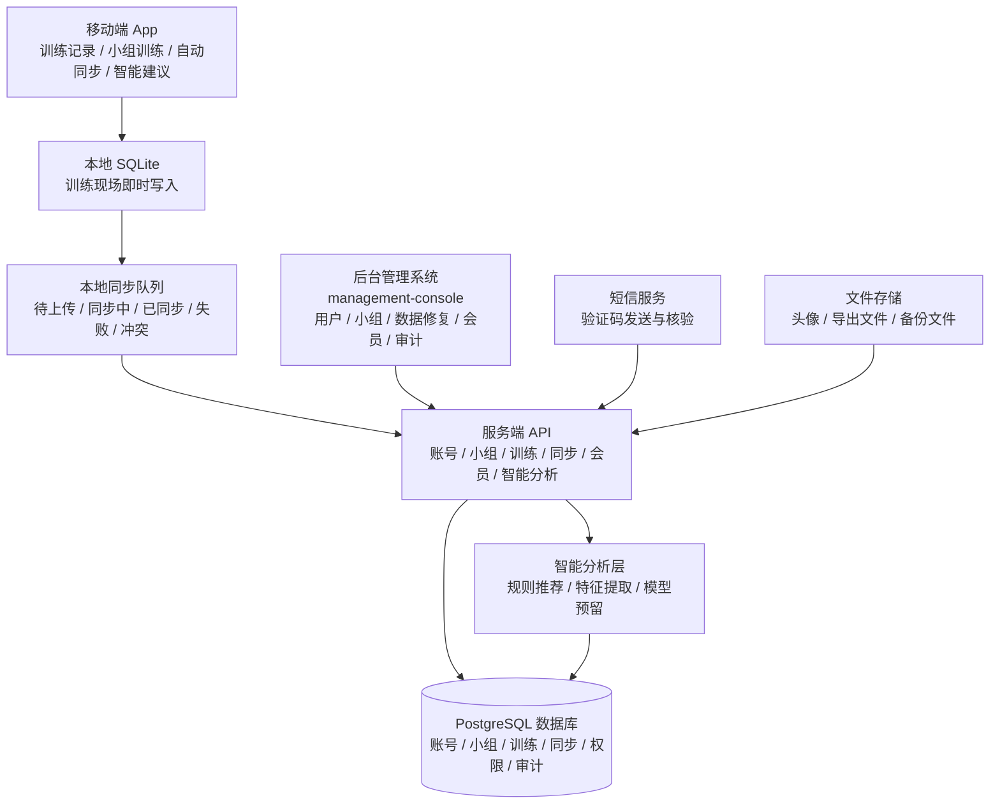
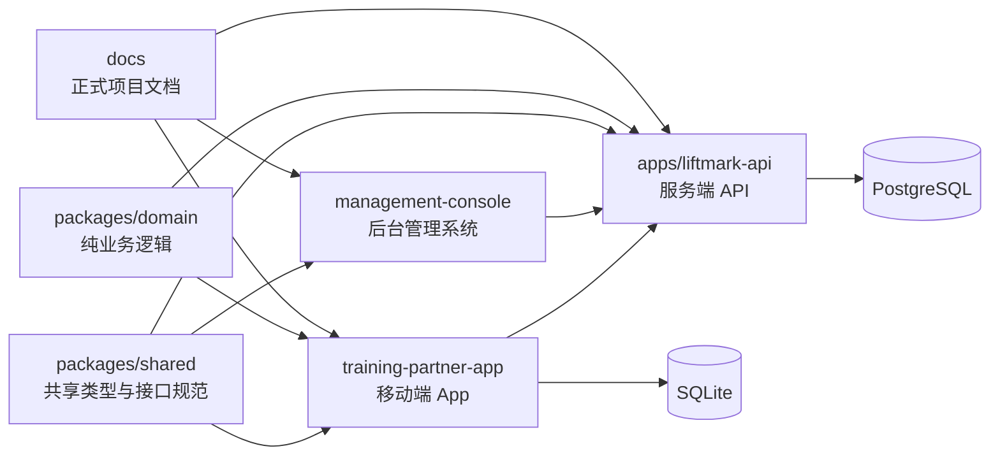
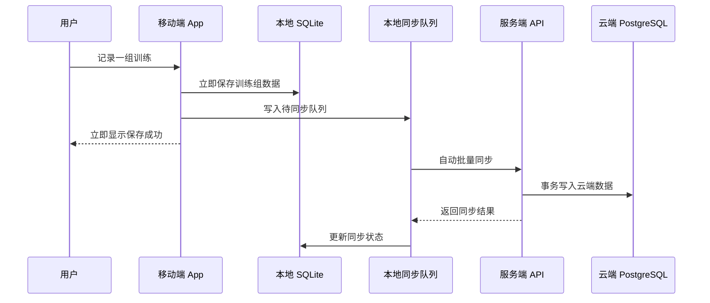
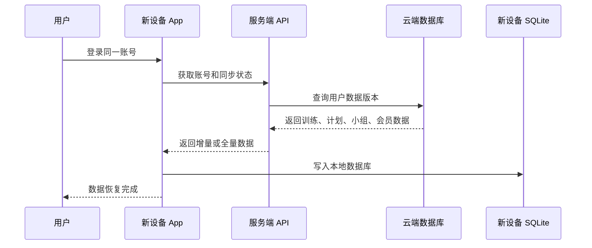
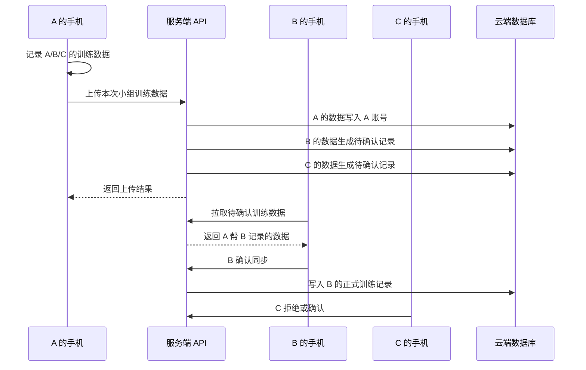
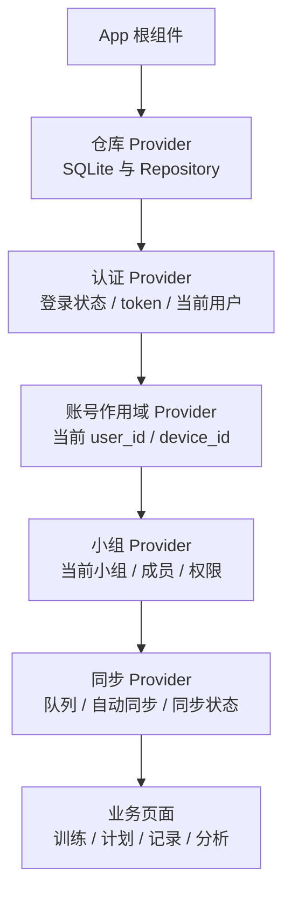
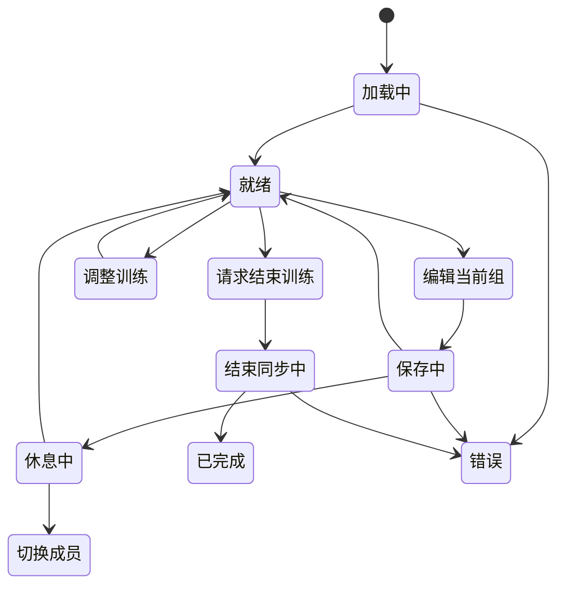
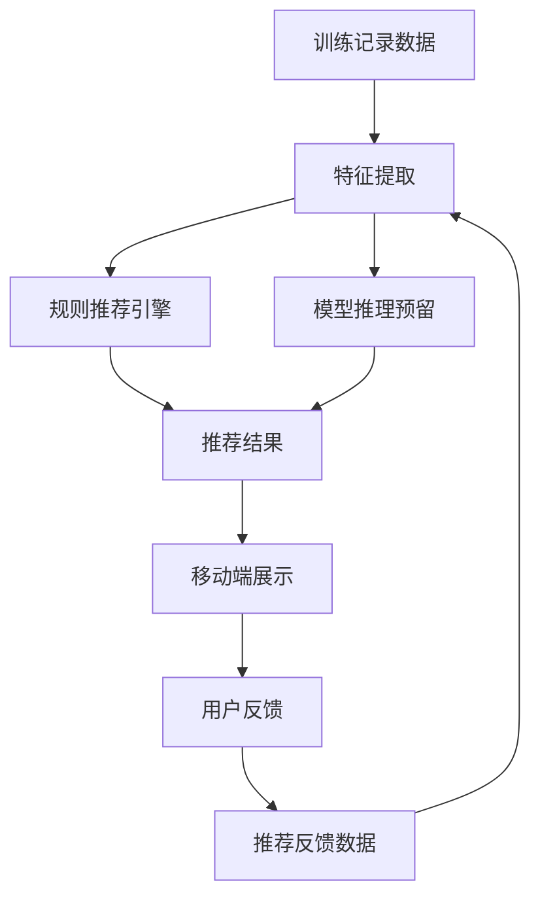

# 练刻 LiftMark 完整架构设计方案 v2

> 适用对象：Codex / 后续 AI 开发工具 / 项目维护者  
> 文档目标：统一练刻 LiftMark 的产品边界、工程目录、账号体系、小组训练、自动同步、后台管理、安全、性能、AI 智能推荐预留和文档管理规范。  
> 当前结论：移动端基于 Expo / React Native 构建，Android 与 iOS 功能设计必须保持一致；当前只是使用 Android 设备进行测试，不代表 Android 独占或 Android 优先。  
> 路径命名结论：原 `backend/` 目录容易和服务端 API 混淆，建议重命名为 `management-console/`，表示“后台管理系统 / 运营管理控制台”。

---

## 0. 当前项目实际情况与命名调整

### 0.1 当前目录现状

当前本地项目大致结构如下：

```text
LiftMark/
  training-partner-app/          # 移动端 App，目前实际存在
  apps/
    liftmark-api/                # 服务端 API，目前实际存在
  backend/                       # 后台管理系统，目前实际存在，但命名不准确
  scripts/                       # 脚本目录
  参考样式图/                    # UI 参考图
  训练计划/                      # 训练计划资料
  验证码获取/                    # 验证码相关测试资料
  验证码核验/                    # 验证码相关测试资料
  README.md
  PRODUCT.md
  CHANGELOG.md
  RELEASE.md
  RELEASE_NOTES.md
```

### 0.2 后台管理系统命名调整

`backend/` 容易被理解为“后端服务”，但项目里已经有真正的服务端 API：

```text
apps/liftmark-api/
```

因此建议把当前 `backend/` 重命名为：

```text
management-console/
```

含义：

```text
management-console = 后台管理系统 / 运营管理控制台 / 超级管理员工具
```

后续文档和提示词统一使用：

```text
management-console/
```

不要再使用：

```text
backend/
admin/
apps/admin/
```

### 0.3 建议最终工程目录

```text
LiftMark/
  training-partner-app/              # 移动端 App，Expo / React Native
  apps/
    liftmark-api/                    # 服务端 API，Fastify / PostgreSQL
  management-console/                # 后台管理系统，原 backend，建议重命名
  packages/                          # 后续新增，共享代码与领域逻辑
    shared/                          # DTO、类型、Zod schema、错误码
    domain/                          # 训练、同步、推荐、权限等纯业务逻辑
    config/                          # 环境配置、功能开关、权限枚举
  docs/                              # 后续新增，正式文档目录
  scripts/                           # 运维、测试、数据修复脚本
  infra/                             # 后续新增，Nginx、PM2、部署配置
  assets/                            # 后续新增，品牌资源、图标、启动图
  archive/                           # 后续新增，历史方案与废弃资料
```

---

## 1. 产品定位与核心原则

### 1.1 产品定位

练刻 LiftMark 是一个面向力量训练与小组训练的训练记录、计划执行、数据同步与智能分析产品。

核心定位：

```text
多人力量训练记录工具
+ 训练计划执行器
+ 小组训练数据同步系统
+ 自动进阶建议系统
+ 智能训练分析平台
```

### 1.2 当前核心场景

当前最优先支持的真实场景：

```text
1. 用户登录账号。
2. 用户创建或加入小组。
3. 小组成员在线下同时训练。
4. 一个人可以在同一台手机上帮多名小组成员记录训练数据。
5. 训练结束后，自己的训练数据直接同步到自己的账号。
6. 帮别人记录的数据发送给对应小组成员。
7. 对方在自己的设备上确认后，数据进入对方账号。
8. 小组统计只统计本人数据和已确认的组员数据。
```

### 1.3 暂不优先做的功能

第一阶段暂不做实时在线同练房间：

```text
实时在线训练房间
WebSocket / SSE 实时状态
1-3 秒队友状态同步
实时多人训练过程协同
```

原因：

```text
1. 实现复杂度高。
2. 使用场景相对少。
3. 当前更重要的是稳定记录、自动同步、小组代记录和确认机制。
4. 后续可以预留 training room 架构，不进入第一阶段主链路。
```

### 1.4 关键架构原则

```text
1. 强制登录后使用正式功能。
2. 移动端本地记录优先，但所有正式数据绑定账号。
3. 用户更换设备后，登录同一账号即可恢复数据。
4. 小组成员必须是真实账号，不再设计本地游客成员和认领流程。
5. 自动无感同步是正式逻辑，手动同步按钮只作为测试和排障入口。
6. 训练数据写入必须稳定，不受网络波动影响。
7. 服务端写入必须事务化、幂等化、可追踪。
8. 后台管理系统必须具备超级管理员的完整排查和特殊数据处理能力。
9. 安全、性能、权限和审计必须作为基础架构，不是后期补丁。
10. AI / 智能分析能力从现在开始预留数据结构和接口，第一阶段先用规则引擎。
```

---

## 2. 总体架构图



---

## 3. 工程模块边界



### 3.1 training-partner-app 移动端

职责：

```text
1. 登录与登录状态保持。
2. 当前用户资料展示和修改。
3. 小组创建、加入、成员展示。
4. 训练计划执行。
5. 本地 SQLite 即时保存训练数据。
6. 自动同步队列管理。
7. 小组成员代记录。
8. 待确认训练数据查看与确认。
9. 训练历史、统计和智能建议展示。
10. 离线或弱网状态下保证训练现场记录可用。
```

不负责：

```text
1. 不直接决定会员最终权益。
2. 不直接修改他人正式训练数据。
3. 不直接绕过服务端确认机制。
4. 不承担后台数据修复功能。
5. 不在页面组件里堆复杂业务逻辑。
```

### 3.2 apps/liftmark-api 服务端 API

职责：

```text
1. 账号认证。
2. 手机号验证码注册和登录。
3. 密码登录和后续邮箱、练刻 ID 登录。
4. 登录设备管理。
5. 小组和成员权限。
6. 训练数据同步。
7. 小组代记录与待确认数据。
8. 会员权益判断。
9. 后台管理接口。
10. 安全限流、审计日志、事务写入。
11. 智能推荐、分析和模型预留接口。
```

### 3.3 management-console 后台管理系统

职责：

```text
1. 超级管理员登录。
2. 用户账号管理。
3. 登录设备管理。
4. 小组管理。
5. 小组权限管理。
6. 训练数据查看、修复、转移和回滚。
7. 待确认训练数据处理。
8. 同步状态和冲突处理。
9. 会员、激活码、订单预留。
10. 反馈、公告、App 配置、功能开关。
11. AI 智能推荐管理。
12. 系统日志、审计日志、备份恢复。
```

后台必须服务于“特殊数据处理”。用户数据异常、同步异常、组员上传错人、手机号换绑失败、小组权限异常等问题，都必须能在后台排查和处理。

---

## 4. 账号体系设计

### 4.1 注册原则

注册必须强制手机号验证码。

```text
注册入口：手机号 + 验证码
注册成功：创建 user_id、手机号、练刻 ID、默认资料
```

禁止：

```text
仅凭密码注册
手机号未验证就注册
第三方账号绕过手机号注册规则
```

### 4.2 登录方式

注册后，一个用户账号可以绑定多种登录方式。

支持：

```text
1. 手机号验证码登录。
2. 手机号 + 密码登录。
3. 练刻 ID + 密码登录。
4. 邮箱 + 密码登录。
5. 后续微信登录。
6. 后续 Apple 登录。
```

这些登录方式都绑定到同一个 `user_id`。

### 4.3 账号标识

```text
users
  id                      # 内部 user_id，不展示
  liftmark_id             # 练刻 ID，可展示、可用于登录
  phone                   # 手机号，可换绑
  email                   # 邮箱，可换绑
  password_hash           # 密码 hash，可为空
  nickname
  avatar_url
  role                    # user / admin / super_admin
  status                  # normal / disabled / deleted
  created_at
  updated_at
```

### 4.4 手机号、邮箱、第三方账号换绑

手机号换绑流程：

```text
1. 用户已登录。
2. 用户发起手机号换绑。
3. 校验当前账号身份，可使用当前手机号验证码、密码或安全验证。
4. 发送新手机号验证码。
5. 新手机号验证码通过。
6. 检查新手机号未被其他账号占用。
7. 更新 phone。
8. 记录安全日志。
9. 通知所有登录设备。
```

邮箱换绑流程：

```text
1. 用户已登录。
2. 用户发起邮箱绑定或换绑。
3. 校验当前账号身份。
4. 发送邮箱验证码或验证链接。
5. 验证通过后绑定。
6. 记录安全日志。
```

第三方账号换绑预留：

```text
user_auth_identities
  id
  user_id
  provider              # phone / email / wechat / apple
  provider_user_id
  bound_at
  unbound_at
  created_at
```

### 4.5 密码设置与重置

```text
首次设置密码：必须通过手机号验证码。
修改密码：需要当前密码或手机号验证码。
忘记密码：手机号验证码重置。
```

---

## 5. 登录状态与设备管理

### 5.1 登录状态策略

不要求每次打开 App 都重新验证。

目标体验：

```text
像 QQ、微信一样，用户登录后长期保持登录状态。
只有长时间未使用、refreshToken 失效、设备被移除、账号异常或安全策略触发时，才要求重新登录。
```

技术策略：

```text
1. accessToken 短期有效。
2. refreshToken 长期有效。
3. App 启动时静默刷新 accessToken。
4. 刷新成功则无感进入。
5. 刷新失败才跳转登录页。
```

### 5.2 登录设备管理

必须增加登录设备管理。

用户端可查看：

```text
当前设备
设备名称
系统类型
App 版本
最近登录时间
最近活跃时间
是否可信设备
```

用户端可操作：

```text
退出当前设备
移除其他设备
全部设备退出登录
```

后台可操作：

```text
查看用户所有设备
强制移除某设备
强制全部设备下线
查看异常登录
查看设备同步状态
```

### 5.3 建议数据表

```text
user_devices
  id
  user_id
  device_id
  device_name
  platform              # ios / android / web
  os_version
  app_version
  push_token
  last_ip
  last_active_at
  trusted_until
  revoked_at
  created_at
  updated_at

user_sessions
  id
  user_id
  device_id
  refresh_token_hash
  expires_at
  revoked_at
  last_used_at
  created_at
  updated_at
```

---

## 6. 本地优先与云同步恢复

### 6.1 正确定义

练刻采用：

```text
本地记录优先 + 账号云同步恢复
```

不是：

```text
游客本地优先
本地成员认领
长期不登录使用
```

含义：

```text
1. 所有正式功能都要求登录账号。
2. 训练现场先写入本地 SQLite，保证速度和稳定性。
3. 网络正常时自动同步到服务器。
4. 用户更换设备或重新安装后，登录同一账号，从云端恢复数据。
```

### 6.2 本地优先流程图



### 6.3 换设备恢复流程



---

## 7. 自动无感同步设计

### 7.1 同步目标

正式用户不应该需要理解“同步按钮”。

自动同步必须覆盖：

```text
训练记录
训练计划
小组成员
用户资料
会员权益
待确认训练数据
智能推荐反馈
设置项
```

手动同步按钮保留用途：

```text
开发测试
用户主动排障
后台客服指导用户排查
```

### 7.2 自动同步触发时机

```text
1. App 启动后。
2. 登录成功后。
3. App 回到前台。
4. 网络从断开变为可用。
5. 完成一组训练后，延迟批量同步。
6. 训练结束后，立即同步。
7. 创建或加入小组后。
8. 修改资料、头像、设置后。
9. 收到待确认训练数据后。
10. 确认或拒绝待确认数据后。
11. 定时轻量同步。
```

### 7.3 同步状态

```text
local_only          # 仅本地
pending_create      # 等待创建
pending_update      # 等待更新
pending_delete      # 等待删除
syncing             # 同步中
synced              # 已同步
sync_failed         # 同步失败
conflict            # 冲突
```

### 7.4 本地同步队列

```text
local_sync_queue
  id
  owner_user_id
  entity_type
  entity_local_id
  operation           # create / update / delete
  payload
  status
  attempts
  last_error
  next_retry_at
  created_at
  updated_at
```

### 7.5 服务端同步事务

服务端 `/sync/push` 必须事务化：

```text
1. 创建 sync_batch。
2. 校验用户身份和数据归属。
3. 校验实体类型和 payload。
4. 幂等检查 client_mutation_id。
5. 批量 upsert 数据。
6. 写入 sync_mappings。
7. 更新 sync_state。
8. 提交事务。
9. 返回每条数据的 server_id 和状态。
```

如果任一步失败：

```text
事务回滚
返回明确错误
移动端保留 pending 或 sync_failed
```

### 7.6 同步幂等

必须支持：

```text
client_mutation_id
client_entity_id
device_id
sync_batch_id
```

防止网络重试导致重复训练记录。

---

## 8. 小组体系设计

### 8.1 小组原则

```text
1. 小组成员必须是真实登录账号。
2. 不再设计本地游客成员。
3. 不再设计后期认领本地数据。
4. 小组通过链接、邀请码、二维码、房间码或搜索加入。
5. 小组成员之间的数据查看和修改必须受权限控制。
```

### 8.2 小组加入方式

```text
1. 邀请链接。
2. 小组邀请码。
3. 二维码。
4. 房间码样式的小组码。
5. 练刻 ID 搜索邀请。
6. 手机号搜索邀请，是否开放由隐私设置控制。
```

### 8.3 小组数据表

```text
groups
  id
  name
  owner_user_id
  invite_code
  member_limit
  status
  created_at
  updated_at
  deleted_at

group_members
  id
  group_id
  user_id
  role                  # owner / admin / member
  status                # invited / active / left / removed
  joined_at
  left_at
  created_at
  updated_at

member_profiles
  id
  group_id
  user_id
  display_name
  avatar_url
  bodyweight
  bench_1rm
  squat_1rm
  deadlift_1rm
  overhead_press_1rm
  barbell_increment
  dumbbell_increment
  created_at
  updated_at

group_invites
  id
  group_id
  inviter_user_id
  invite_code
  invite_type           # link / qrcode / manual
  max_uses
  used_count
  expires_at
  created_at
```

---

## 9. 小组训练数据权限设计

### 9.1 为什么需要权限

小组功能涉及：

```text
组员帮我记录训练
组员向我提交待确认训练数据
组员查看我的训练概要
组员查看我的详细训练记录
组员查看我的训练分析
组员修改训练记录
小组排行榜
小组统计
```

这些不能默认全部开放。

### 9.2 默认权限建议

```text
允许组员向我提交待确认训练数据：默认开启
允许组员直接修改我的正式训练记录：默认关闭
允许组员查看我的训练概要：默认开启
允许组员查看我的详细训练记录：默认关闭
允许组员查看我的训练分析：默认关闭
允许参与小组统计：默认开启
允许参与小组排行榜：默认开启，但用户可关闭
```

### 9.3 权限数据表

```text
group_member_permissions
  id
  group_id
  user_id
  allow_submit_pending_training
  allow_view_summary
  allow_view_detail_records
  allow_view_analysis
  allow_edit_confirmed_records
  allow_join_leaderboard
  allow_group_statistics
  updated_at
```

### 9.4 修改训练记录权限

原则：

```text
1. 自己可以修改自己的训练记录。
2. 组长不能默认修改组员正式记录。
3. 如果组员开放权限，组长或指定成员可以提交修改请求。
4. 修改他人正式训练记录必须进入待确认流程或留下审计日志。
5. 后台超级管理员可以特殊修复，但必须填写原因并记录审计。
```

---

## 10. 小组代记录与待确认训练数据

### 10.1 业务场景

```text
A、B、C 属于同一个小组。
三人一起训练。
A 用自己的手机记录 A、B、C 的训练数据。
训练结束后：
  A 的数据直接同步到 A 账号。
  B 的数据发送给 B，等待 B 确认。
  C 的数据发送给 C，等待 C 确认。
B 和 C 确认后，数据进入各自账号。
```

### 10.2 流程图



### 10.3 数据归属字段

每条训练组数据必须明确：

```text
recorded_by_user_id      # 谁记录的
owner_user_id            # 这条训练数据属于谁
group_id                 # 属于哪个小组场景
confirmed_by_user_id     # 谁确认的
confirmation_status      # self_recorded / pending / accepted / rejected
```

### 10.4 待确认数据结构

建议使用两层结构：

```text
group_workout_submissions
  id
  group_id
  uploader_user_id
  source_device_id
  source_session_client_id
  training_date
  title
  status                # submitted / partially_accepted / completed / cancelled
  submitted_at
  created_at
  updated_at

group_workout_submission_recipients
  id
  submission_id
  group_id
  target_user_id
  uploader_user_id
  target_session_client_id
  session_data
  sets_data
  status                # pending / accepted / rejected / expired / cancelled
  accepted_session_server_id
  responded_at
  expires_at
  created_at
  updated_at
```

### 10.5 确认后写入规则

```text
1. 接收者必须是 target_user_id。
2. 接收者必须仍然是小组成员，或数据产生时是小组成员。
3. pending 状态必须是 pending。
4. 写入 workout_sessions 和 workout_sets 必须在同一个事务内。
5. 写入成功后 pending 状态改为 accepted。
6. 小组统计只统计 accepted 和 self_recorded 数据。
```

---

## 11. 训练数据结构设计

### 11.1 核心表

```text
workout_sessions
  id
  user_id
  group_id
  title
  training_date
  started_at
  ended_at
  duration_seconds
  status                # active / completed / cancelled
  source                # self / group_submission / import
  recorded_by_user_id
  confirmed_by_user_id
  client_id
  created_at
  updated_at
  deleted_at

workout_sets
  id
  session_id
  user_id
  group_id
  exercise_id
  set_number
  planned_weight
  planned_reps
  actual_weight
  actual_reps
  completed
  skipped
  rest_seconds
  notes
  source
  recorded_by_user_id
  confirmed_by_user_id
  client_id
  created_at
  updated_at
  deleted_at
```

### 11.2 不建议长期只依赖 payload

后期要做分析和 AI，核心字段必须结构化：

```text
user_id
exercise_id
actual_weight
actual_reps
completed
skipped
training_date
group_id
recorded_by_user_id
confirmed_by_user_id
```

payload 可以保留，但只能作为扩展字段。

---

## 12. 移动端状态管理架构

### 12.1 Provider 分层



### 12.2 训练执行状态机

训练执行页必须拆成状态机，不要继续在页面里堆大量 `useState`。



### 12.3 训练执行页模块拆分

```text
src/features/workout-execution/
  WorkoutExecutionScreen.tsx
  components/
    ExerciseCard.tsx
    SetRecorder.tsx
    MemberSwitcher.tsx
    RestTimer.tsx
    WorkoutProgress.tsx
    FinishWorkoutDialog.tsx
  hooks/
    useWorkoutExecutionMachine.ts
    useSetSaving.ts
    useRestTimer.ts
    useWorkoutParticipants.ts
    useWorkoutFinish.ts
  services/
    workoutExecutionService.ts
  types.ts
```

---

## 13. 后台管理系统 management-console 设计

### 13.1 后台定位

后台不是普通用户功能，而是项目所有者和超级管理员使用的运营、排查、修复和配置系统。

后台必须具备：

```text
全部数据查看能力
全部账号管理能力
全部小组管理能力
全部训练数据特殊处理能力
全部会员权益处理能力
全部同步问题排查能力
```

但所有高危操作必须具备：

```text
二次确认
填写原因
审计日志
操作结果记录
必要时支持回滚
```

### 13.2 后台功能模块

```text
1. 仪表盘
   - 用户总数
   - 今日新增用户
   - 活跃用户
   - 训练记录数量
   - 同步失败数量
   - 待确认训练数据数量
   - 服务器状态

2. 用户账号管理
   - 搜索用户
   - 查看用户资料
   - 修改用户状态
   - 手机号/邮箱换绑辅助
   - 重置密码辅助
   - 封禁/恢复账号
   - 查看用户小组
   - 查看用户训练概览

3. 登录设备管理
   - 查看设备列表
   - 强制设备下线
   - 强制全部设备下线
   - 查看最近登录记录
   - 异常设备标记

4. 小组管理
   - 查看小组列表
   - 查看成员
   - 修改小组名称
   - 转移组长
   - 移除异常成员
   - 重置邀请码
   - 调整成员上限

5. 小组权限管理
   - 查看成员权限
   - 修改异常权限
   - 恢复默认权限
   - 查看权限变更历史

6. 训练记录管理
   - 查看用户训练记录
   - 查看小组训练记录
   - 查看训练详情
   - 修复异常记录
   - 合并重复记录
   - 删除错误记录
   - 恢复误删记录
   - 转移归属错误的数据

7. 待确认训练数据管理
   - 查看 pending 数据
   - 查看上传者和接收者
   - 重新发送提醒
   - 取消错误提交
   - 管理员特殊确认或拒绝
   - 查看处理历史

8. 同步状态管理
   - 查看同步队列
   - 查看同步批次
   - 查看失败原因
   - 重试同步
   - 标记冲突
   - 查看设备同步状态

9. 数据修复工具
   - 重建统计数据
   - 修复 orphan 数据
   - 修复 user_id 归属
   - 修复 group_id 归属
   - 修复重复 set
   - 重算训练总量

10. 会员管理
    - 查看会员状态
    - 手动开通会员
    - 延长会员
    - 撤销会员
    - 查看权益来源
    - 查看激活码兑换记录

11. 激活码管理
    - 生成激活码
    - 批量生成
    - 设置有效期
    - 设置权益类型
    - 查看使用记录
    - 作废激活码

12. 订单与支付预留
    - 查看订单
    - 手动补单
    - 退款标记
    - 支付渠道预留

13. 反馈管理
    - 用户反馈列表
    - Bug 反馈
    - 功能建议
    - 处理状态
    - 回复记录

14. 公告管理
    - 创建公告
    - 上下架公告
    - 版本公告
    - 内测公告

15. App 配置管理
    - 远程配置
    - 功能开关
    - 最低版本
    - 强制更新
    - 灰度开关

16. AI / 智能推荐管理
    - 推荐规则配置
    - 推荐结果查看
    - 用户反馈查看
    - 模型版本预留
    - 模型效果统计预留

17. 文件管理
    - 头像文件
    - 导出文件
    - 异常文件
    - 清理无效文件

18. 系统日志
    - API 错误日志
    - 短信日志
    - 同步日志
    - 文件上传日志

19. 审计日志
    - 管理员登录
    - 数据修改
    - 会员变更
    - 权限变更
    - 敏感操作

20. 备份与恢复
    - 数据库备份状态
    - 手动触发备份
    - 查看备份文件
    - 恢复流程记录
```

---

## 14. 会员权益设计

### 14.1 原则

```text
1. 免费用户必须能正常使用核心训练记录。
2. 免费用户必须能云同步和换设备恢复基础数据。
3. 会员主要扩展小组容量、高级分析、智能推荐、批量编辑和长期统计。
4. 用户自己的历史数据不能因为会员过期而不可访问。
5. 会员过期后，高级功能停止新增或高级分析受限，但基础数据仍可查看。
```

### 14.2 免费用户

```text
手机号注册和登录
基础云同步
更换设备恢复数据
个人训练记录
基础训练计划
基础历史记录
加入小组
创建 1 个小组
小组最多 2 人
允许组员提交待确认训练数据
基础训练分析
基础智能建议
```

### 14.3 Pro 会员

建议默认：

```text
可激活 3 个小组
每组最多 4 人
```

Pro 权益：

```text
更多小组数量
更多小组成员
高级训练分析
动作维度趋势
小组对比分析
训练周报/月报
智能重量推荐
智能疲劳提醒
批量编辑历史记录
数据导出
更多小组权限控制
长期趋势分析
```

### 14.4 永久会员

```text
长期 Pro 权益
永久解锁个人高级分析
永久解锁智能推荐
永久解锁指定数量小组权益
```

### 14.5 团队版预留

```text
更大小组人数
教练 / 队长权限
成员数据看板
团队训练统计
批量导入成员
团队导出
```

### 14.6 权益判断位置

会员权益必须由服务端最终判断。

移动端可以缓存权益，但不能作为最终依据。

---

## 15. AI / 智能分析预留

### 15.1 总原则

现在没有数据集，不应强行训练模型。

正确路线：

```text
第一阶段：规则引擎 + 统计分析
第二阶段：沉淀训练特征和用户反馈
第三阶段：训练小模型
第四阶段：引入模型服务或端侧模型
```

### 15.2 可宣传能力

第一阶段可以宣传：

```text
智能训练分析
智能重量建议
自动训练趋势分析
个性化进阶提醒
小组训练数据智能汇总
```

不要宣传成：

```text
AI 保证增肌
AI 诊断伤病
AI 精准预测极限
```

### 15.3 智能推荐数据表

```text
recommendation_snapshots
  id
  user_id
  group_id
  exercise_id
  session_id
  recommendation_type
  source                  # rule_based / model
  suggested_weight
  suggested_reps
  suggested_sets
  confidence
  reason
  features
  created_at

recommendation_feedback
  id
  recommendation_id
  user_id
  action                  # accepted / ignored / modified / rejected
  actual_weight
  actual_reps
  actual_sets
  result                  # success / failed / skipped
  created_at

workout_features
  id
  user_id
  exercise_id
  session_id
  feature_date
  recent_volume_7d
  recent_volume_28d
  completion_rate_7d
  completion_rate_28d
  avg_rest_seconds
  max_weight_recent
  estimated_1rm
  fatigue_score
  plan_adherence
  created_at

model_versions
  id
  name
  version
  model_type
  storage_path
  metrics
  status                  # draft / active / deprecated
  created_at
  activated_at

model_predictions
  id
  model_version_id
  user_id
  exercise_id
  input_features
  prediction
  confidence
  created_at
```

### 15.4 智能模块接口

```text
GET  /intelligence/summary
GET  /intelligence/recommendations/today
GET  /intelligence/recommendations/exercise/:exerciseId
POST /intelligence/recommendations/:id/feedback
GET  /intelligence/insights/history
GET  /intelligence/model/status
```

### 15.5 智能层架构图



---

## 16. 安全架构

### 16.1 安全范围

必须覆盖：

```text
账号安全
验证码安全
密码安全
token 安全
设备安全
小组数据权限
后台超级管理员权限
CORS
HTTPS
限流
上传文件
审计日志
密钥管理
备份恢复
```

### 16.2 验证码安全

```text
1. 同手机号发送间隔限制。
2. 同手机号每日发送次数限制。
3. 同 IP 每日发送次数限制。
4. 验证码有效期。
5. 验证码错误次数限制。
6. 验证码验证成功后立即失效。
```

### 16.3 密码安全

```text
1. 密码只保存 hash。
2. 不保存明文密码。
3. 密码登录失败次数限制。
4. 弱密码提示。
5. 修改密码后可选择退出其他设备。
```

### 16.4 接口限流

必须限流的接口：

```text
/auth/send-code
/auth/login-with-code
/auth/password-login
/auth/refresh
/auth/change-phone
/auth/change-email
/sync/push
/pending-training/upload
/pending-training/:id/accept
/activation-codes/redeem
/management-console/login
```

### 16.5 CORS 与 HTTPS

```text
1. 开发环境可以允许 localhost 和测试设备。
2. 生产环境必须使用 HTTPS 域名。
3. 生产环境 CORS 必须白名单。
4. 不允许长期使用 http://服务器 IP 作为正式 API 地址。
```

### 16.6 后台高危操作保护

高危操作包括：

```text
封禁用户
删除训练记录
修复训练归属
修改手机号
修改会员状态
强制下线设备
处理待确认训练数据
修改小组权限
```

必须要求：

```text
二次确认
填写操作原因
写审计日志
记录操作前后数据
必要时支持回滚
```

---

## 17. 性能架构

### 17.1 移动端性能

```text
1. App 启动减少阻塞任务。
2. 登录状态静默恢复。
3. SQLite 查询必须加索引。
4. 训练页组件拆分，减少不必要重渲染。
5. 完成一组后本地立即保存，同步异步进行。
6. 训练中同步防抖，避免每组都立刻请求服务器。
7. 图片压缩和缓存。
8. 历史记录分页加载。
9. 图表数据预聚合或分页查询。
```

### 17.2 服务端性能

```text
1. 所有列表接口分页。
2. 用户、group_id、training_date、exercise_id 建索引。
3. 同步接口批量处理。
4. 训练统计预计算。
5. 大型分析任务异步执行。
6. 后台导出任务异步执行。
7. 慢查询日志。
8. API 响应时间监控。
```

### 17.3 数据库索引建议

```text
users(phone)
users(email)
users(liftmark_id)
group_members(group_id, user_id)
workout_sessions(user_id, training_date)
workout_sessions(group_id, training_date)
workout_sets(user_id, exercise_id, created_at)
workout_sets(session_id)
sync_mappings(user_id, client_id)
local_sync_queue(owner_user_id, status)
group_workout_submission_recipients(target_user_id, status)
recommendation_snapshots(user_id, created_at)
```

---

## 18. 部署与环境

### 18.1 服务组成

```text
移动端 App：Expo / React Native
服务端 API：apps/liftmark-api
后台管理系统：management-console
数据库：PostgreSQL
反向代理：Nginx
进程管理：PM2
短信服务：阿里云短信或其他供应商
文件存储：本地 uploads 起步，后续可迁移对象存储
```

### 18.2 环境变量

```text
NODE_ENV
PORT
HOST
DATABASE_URL
JWT_SECRET
JWT_REFRESH_SECRET
CORS_ALLOWED_ORIGINS
SMS_PROVIDER
ALIYUN_ACCESS_KEY_ID
ALIYUN_ACCESS_KEY_SECRET
ALIYUN_DYPNS_SIGN_NAME
ALIYUN_DYPNS_TEMPLATE_CODE
UPLOAD_ROOT
PUBLIC_UPLOAD_BASE_URL
```

### 18.3 密钥管理

禁止把以下内容提交到 Git：

```text
.pem 私钥
.env
数据库密码
JWT secret
阿里云 access key
短信服务密钥
```

建议本地密钥放在：

```text
C:\Users\zhw\Documents\LiftMark-Secrets\
```

项目目录只保留密钥管理说明，不保存密钥文件本身。

---

## 19. 文档目录规范

当前根目录文档较多，后续必须整理到 `docs/`。

建议目录：

```text
docs/
  00-project/
    项目总览.md
    目录说明.md
    Codex阅读顺序.md
    术语表.md

  01-product/
    产品定位.md
    功能清单.md
    小组训练方案.md
    会员权益方案.md
    版本规划.md

  02-design/
    UI设计规范.md
    品牌规范.md
    图标规范.md
    参考样式图说明.md

  03-architecture/
    完整架构设计方案.md
    工程结构设计.md
    模块边界设计.md

  04-api/
    API接口规范.md
    认证接口.md
    小组接口.md
    训练接口.md
    同步接口.md
    后台接口.md
    错误码规范.md

  05-database/
    数据库设计.md
    表结构说明.md
    索引设计.md
    迁移说明.md
    数据修复说明.md

  06-mobile/
    移动端架构.md
    页面路由.md
    状态管理.md
    SQLite本地数据库.md
    训练执行页重构.md

  07-api-server/
    服务端API架构.md
    Fastify模块说明.md
    鉴权中间件.md
    限流设计.md
    事务设计.md

  08-management-console/
    后台管理系统架构.md
    后台页面设计.md
    超级管理员权限.md
    数据修复功能.md
    审计日志.md

  09-sync/
    自动同步设计.md
    本地同步队列.md
    冲突处理.md
    小组代记录同步.md
    换设备数据恢复.md

  10-security/
    账号安全.md
    设备管理.md
    小组数据权限.md
    后台权限.md
    密钥管理.md

  11-deployment/
    服务器部署.md
    Nginx配置.md
    PM2配置.md
    PostgreSQL备份.md
    上线检查清单.md

  12-testing/
    测试计划.md
    接口测试.md
    App测试.md
    同步测试.md
    权限测试.md
    后台测试.md

  13-ai-intelligence/
    智能推荐架构.md
    规则引擎.md
    模型预留.md
    推荐反馈.md
    AI功能路线.md

  14-business/
    商业模式.md
    激活码方案.md
    价格策略.md
    内测策略.md

  15-operations/
    用户问题处理.md
    数据修复流程.md
    后台操作规范.md
    异常情况处理.md

  16-prompts/
    Codex提示词.md
    UI设计提示词.md
    Bug修复提示词.md
    架构重构提示词.md

  99-archive/
    历史方案/
    废弃方案/
    临时讨论/
```

---

## 20. Codex 开发要求

### 20.1 重要命名要求

Codex 必须遵守：

```text
1. 移动端目录仍为 training-partner-app，除非单独执行目录迁移任务。
2. 服务端 API 目录仍为 apps/liftmark-api。
3. 当前 backend 目录应重命名为 management-console。
4. 不要使用 admin 或 backend 表示后台管理系统。
5. 不要写 Android-only 逻辑。
6. Android 与 iOS 功能必须一致。
```

### 20.2 开发顺序建议

```text
第一阶段：文档和目录整理
  - 新建 docs 目录
  - 放入本架构文档
  - 将 backend 重命名为 management-console
  - 更新 README 和路径引用

第二阶段：账号体系修正
  - 注册强制手机号验证码
  - 登录支持验证码和密码方式
  - 增加练刻 ID
  - 增加邮箱绑定预留
  - 增加设备管理表

第三阶段：安全与性能基线
  - CORS 白名单
  - HTTPS 配置预留
  - 接口限流
  - 后台审计日志
  - 列表分页

第四阶段：自动同步
  - SyncProvider
  - 自动同步触发器
  - /sync/push 事务化
  - 手动同步按钮保留测试用途

第五阶段：小组代记录
  - 小组成员真实账号化
  - 去除本地游客成员
  - 训练结束后拆分 owner_user_id
  - 他人数据进入待确认
  - 对方确认后入库

第六阶段：后台管理系统完善
  - 用户管理
  - 设备管理
  - 小组管理
  - 训练数据修复
  - 待确认训练数据管理
  - 会员管理
  - 审计日志

第七阶段：智能分析预留
  - 规则引擎
  - 推荐记录表
  - 推荐反馈表
  - 智能建议 API
```

### 20.3 禁止事项

```text
1. 不要提交 .env、.pem、数据库密码、短信密钥。
2. 不要绕过手机号验证码注册。
3. 不要让小组成员直接写入他人正式训练记录。
4. 不要把 AI 推荐逻辑写死在训练页面里。
5. 不要继续扩大单个训练页面的 useState。
6. 不要把后台管理系统继续叫 backend。
7. 不要写 Android 独占能力。
8. 不要把手动同步作为正式用户主流程。
```

---

## 21. 最终架构总结

练刻 LiftMark 的目标架构是：

```text
跨平台移动端
+ 本地记录优先
+ 账号云同步恢复
+ 真实账号小组
+ 小组代记录待确认
+ 自动无感同步
+ 超级后台管理系统
+ 完整安全与性能基线
+ 会员权益系统
+ AI 智能分析预留
```

核心主链路：

```text
用户登录
-> 创建或加入小组
-> 小组成员线下一起训练
-> 一台设备可帮多人记录
-> 本人数据直接同步
-> 他人数据进入待确认
-> 对方确认后同步到本人账号
-> 小组统计纳入确认后的数据
-> 后台可排查和修复异常
-> 后期智能分析和模型推荐持续增强
```

第一阶段不要追求复杂在线房间，而要优先把下面这些做稳：

```text
账号体系
自动同步
小组真实成员
小组代记录
待确认数据
权限控制
后台修复能力
安全与性能基线
AI 数据预留
```

只要这些基础打好，后期无论增加在线同练、AI 推荐、会员商业化、小组排行榜、训练周报，都会有清晰的扩展空间。
