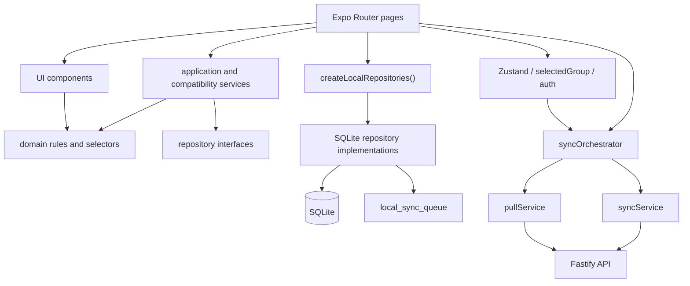
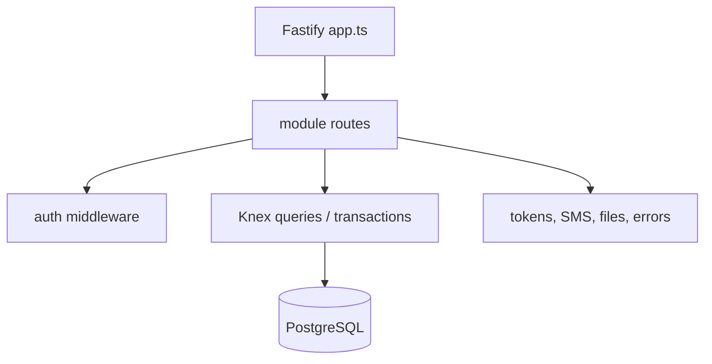

# LiftMark current-state architecture audit — 2026-07-11

> 本文第 2–12 节记录重构开始前的基线快照，因此保留当时的旧目录和耦合路径。第 14 节记录本轮收敛结果。

## 1. Audit baseline and safety boundary

- Repository baseline: `2f01f63` on `master`; working branch: `refactor/architecture-convergence-20260711`.
- The earlier acceptance baseline `6f84f56` is present in history. Its homepage parsing, empty-plan, soft-delete, member reference, `member_profiles.deleted_at`, and focus-loop fixes must remain intact.
- Tracked files were clean before the branch was created. Existing untracked documentation, diagnostics scripts, previews, and reference images are user-owned and are excluded from this work.
- No production database writes, server deployment, PM2/Nginx changes, or ownership rewrites are in scope. The 176 production account is read-only and protected.

## 2. Current three-client repository structure

```text
LiftMark/
  training-partner-app/       Expo / React Native mobile application
    app/                      Expo Router route components
    src/domain/               pure domain rules and types
    src/data/                 SQLite schema, migrations, repositories, seed
    src/services/             application/integration services
    src/sync/                 current pull/push/queue orchestration
  apps/liftmark-api/          Fastify / Knex / PostgreSQL API
    src/modules/              auth, groups, sync, workouts, admin, ...
    src/db/                   connection, migrations, seed
  backend/                    Next.js management console (misnamed)
  docs/                       handoff and architecture documentation
  scripts/                    deployment, backup, and diagnostics scripts
```

Target boundary for this convergence round:

```text
training-partner-app/         mobile
apps/liftmark-api/            API
management-console/           operations/admin console
packages/shared/              minimal stable cross-client contracts
```

## 3. Mobile dependency graph



The intended layers exist, but large routes still instantiate repositories and orchestrate business workflows directly. `accountScope.ts` protects many repository queries, while selected group, member, active plan, and active cycle still come from several independent sources.

## 4. API dependency graph



Auth and sync routes currently combine HTTP validation, business rules, transaction boundaries, and direct queries. `/sync/push` is transactional, but route-level mapping and persistence are still coupled. `/sync/pull` catches every entity-table query error and returns an empty array, hiding required migration failures.

## 5. Actual core data chain

```text
stored authenticated session
  -> accountScope.getRequiredCurrentUserId()
  -> groups visible through owner_user_id or real group membership
  -> selectedGroupStore.selectedGroupId (with several page-level fallbacks)
  -> group_members / member_profiles and page-specific default-member rules
  -> groups.active_plan_id -> account-scoped, non-system plan_templates
  -> active plan_cycles for plan/group/account
  -> plan_phases -> plan_days -> plan_exercises
  -> workout_sessions -> workout_exercise_records -> workout_sets
  -> training_reports
  -> local_sync_queue(owner_user_id)
  -> pull-before-push API sync -> PostgreSQL entity tables
```

The chain is structurally present. Its weak point is context resolution: pages can still independently combine SecureStore, Zustand, route parameters, and repository fallbacks.

## 6. SQLite/PostgreSQL and sync entity matrix

| Sync entity | SQLite table | PostgreSQL table | Owner | Group | Parent/reference | Delete strategy |
|---|---|---|---|---|---|---|
| `exercises` | `exercises` | `exercises` | system/custom creator | n/a | n/a | soft-delete metadata when synced |
| `trainingPlans` | `plan_templates` | `training_plans` | `owner_user_id` / creator | via active group | origin scheme | `deleted_at` tombstone |
| `planPhases` | `plan_phases` | `plan_phases` | `owner_user_id` | inherited | `plan_id` | `deleted_at` tombstone |
| `planDays` | `plan_days` | `plan_days` | `owner_user_id` | inherited | `plan_id`, `phase_id` | `deleted_at` tombstone |
| `planExercises` | `plan_exercises` | `plan_exercises` | `owner_user_id` | inherited | `plan_day_id`, `exercise_id` | `deleted_at` tombstone |
| `planCycles` | `plan_cycles` | `plan_cycles` | `owner_user_id` | `group_id` | `plan_id` | soft delete/status archive |
| `planCycleSummaries` | `plan_cycle_summaries` | `plan_cycle_summaries` | `owner_user_id` | `group_id` | `plan_id`, `plan_cycle_id` | soft delete |
| `workoutSessions` | `workout_sessions` | `workout_sessions` | `owner_user_id` | `group_id` | plan/cycle/day | `deleted_at` tombstone |
| `workoutExerciseRecords` | `workout_exercise_records` | `workout_exercise_records` | `owner_user_id` | inherited/session | `session_id`, plan/exercise refs | `deleted_at` tombstone |
| `workoutSets` | `workout_sets` | `workout_sets` | `owner_user_id` | inherited/session | session/record/member | `deleted_at` tombstone |
| `trainingReports` | `training_reports` | `training_reports` | `owner_user_id` | `group_id` | session/plan/cycle/member | soft delete |
| `trainingReminders` | `training_reminders` | `training_reminders` | `owner_user_id` | `group_id` | plan/cycle | soft delete/disable |
| `bodyMetrics` | `body_metrics` | `body_metrics` | `owner_user_id` | via member | `member_id` | soft delete |
| `bodyMetricGoals` | `body_metric_goals` | `body_metric_goals` | `owner_user_id` | via member | `member_id` | soft delete |
| `recoveryLogs` | `recovery_logs` | `recovery_logs` | `owner_user_id` | via member | `member_id` | soft delete |
| `progressionSuggestions` | `progression_suggestions` | `progression_suggestions` | `owner_user_id` | inherited | member/exercise/session | soft delete |
| `settings` | `user_preferences` | `settings` | `owner_user_id` | optional | account | overwrite/LWW |

`groups`, `groupMembers`, and `memberProfiles` are declared mobile entity types but are currently synchronized through dedicated profile/group endpoints rather than the generic push entity set. This is a deliberate transitional split that must be made explicit in the registry.

## 7. Direct route-to-repository and route-to-sync coupling

Representative high-impact locations:

- `app/(tabs)/today.tsx`: constructs every repository and performs group/member/plan/session/report resolution, compatibility repair, workout creation, and navigation.
- `app/workout/[sessionId].tsx`: performs session loading, set writes, exercise/member mutation, finish/report/sync coordination, timer state, and sheet state.
- `app/(tabs)/plan.tsx`: queries plan structure plus session details and performs plan lifecycle writes.
- `app/workout/summary/[sessionId].tsx`: loads repositories and writes plan changes from session adjustments.
- history, profile, members, settings, and onboarding routes also instantiate repositories directly.
- `app/_layout.tsx` calls the sync orchestrator directly; the workout route calls `requestImmediateSync()` directly.

The P0 target is not to migrate every route. It is to establish `AppScope`, scoped repositories, home use cases, workout use cases/controller, and sync coordinators, then move the two largest routes first.

## 8. Oversized business files

Excluding static seed/catalog data, the notable files over 500 lines are:

| Lines | File |
|---:|---|
| 3076 | `training-partner-app/app/(tabs)/today.tsx` |
| 2497 | `training-partner-app/app/workout/[sessionId].tsx` |
| 1968 | `training-partner-app/src/data/local/repositories/workoutRepository.ts` |
| 1716 | `training-partner-app/src/sync/pullService.ts` |
| 1612 | `training-partner-app/app/(tabs)/plan.tsx` |
| 1487 | `apps/liftmark-api/src/modules/admin/admin.extended.routes.ts` |
| 1268 | `training-partner-app/src/data/local/repositories/planRepository.ts` |
| 1211 | `training-partner-app/src/components/account/AccountPanel.tsx` |
| 1093 | `training-partner-app/src/domain/history/history-analysis.ts` |
| 1061 | `training-partner-app/src/data/local/migrations.ts` |
| 879 | `training-partner-app/app/history/[sessionId].tsx` |
| 776 | `backend/lib/data.ts` |
| 666 | `apps/liftmark-api/src/db/migrate.ts` |
| 655 | `training-partner-app/src/services/profileSyncService.ts` |

## 9. Pages with more than ten React states

| State hooks | Page |
|---:|---|
| 34 | `app/(tabs)/today.tsx` |
| 23 | `app/workout/[sessionId].tsx` |
| 20 | `app/(tabs)/plan.tsx` |
| 16 | `app/onboarding/training-profile.tsx` |
| 13 | `app/plan/create.tsx` |
| 12 | `app/profile/body-metrics.tsx` |
| 12 | `app/history/[sessionId].tsx` |
| 12 | `app/history/manual.tsx` |

## 10. N+1 and query waterfall findings

- Home: `listSessions()` followed by one `getSessionDetail()` per weekly/recent session.
- Plan dashboard: recent sessions followed by one detail query per session.
- Body metrics and group exercise analysis: session lists followed by per-session detail queries.
- Home member profiles: one `getMemberProfile()` per member.
- Workout/summary: member profiles and plan exercises are loaded in per-item loops.
- Plan editors: one `listPlanExercises()` per day.

The first aggregation target is a scoped home snapshot/weekly summary implemented with SQLite joins and grouped aggregates. Broader history analytics aggregation remains P1 after the route convergence.

## 11. Duplicated contracts and error boundaries

- Sync entity names are duplicated in mobile `syncTypes.ts`, mobile `syncService.ts`, server `sync.routes.ts`, migrations, and pull appliers.
- Push/pull entity schemas and mappings are maintained independently on mobile and server.
- Plan/session/cycle statuses occur in domain types, UI labels, SQLite, and server payloads.
- API error codes are string literals spread through route handlers and client error mapping.
- Mobile payload hydration currently uses `SELECT *` because queue producers do not share explicit serializers.

## 12. Difference matrix

| Target capability | Current state | Gap / action |
|---|---|---|
| Account-scoped repository reads | substantially implemented | expose one scoped factory and AppScope contract |
| Account-scoped cursors and full pull | implemented | preserve and add failure/cursor tests |
| Transactional `/sync/push` | implemented | preserve; move orchestration out of route incrementally |
| Verified-phone registration | not implemented | make `code` required and always verify before create |
| Production CORS allowlist | not implemented | validate env at startup; reject unlisted web origins |
| Sensitive route throttling | not implemented | add Fastify rate-limit policies |
| Stable installation device ID | not implemented | SecureStore-backed random ID |
| Explicit sync serializers | not implemented | registry plus serializers; phase/day/exercise first |
| Missing critical sync table error | not implemented | return `SERVER_SCHEMA_OUTDATED`; keep cursor unchanged |
| Unified AppScope | partial account scope only | add provider/service/account-switch reset |
| Thin home route | not implemented | extract state/use cases/controller and aggregates |
| Workout reducer/controller | not implemented | extract state model, serialized writes, timer service |
| Local-first workout completion/report | implemented | preserve; make sync/report failures non-blocking |
| Minimal shared contracts | not implemented | create standalone package without forcing workspace migration |
| Three-client directory naming | not implemented | rename console and all repository references |

## 13. Scope of this convergence round

In scope:

- directory/README/config convergence;
- registration, CORS, throttling, upload guards, and stable error codes;
- AppScope and scoped repository entry point;
- home application state/use cases/controller plus aggregate query path;
- workout state/reducer/controller, serialized set writes, timestamp timers, finish flush;
- sync registry, explicit serializers, queue/push/pull/device boundaries;
- server missing-schema error behavior;
- focused isolation, security, home, workout, and sync tests.

Explicitly out of scope:

- UI/brand redesign;
- third-party exercise media;
- production migrations or data repair;
- ownership changes for either protected account;
- realtime training rooms, WebSocket/SSE, payment, or AI model integration;
- deleting legacy local data solely to make tests pass;
- complete migration of every route and every domain type into a monorepo package.

## 14. Convergence result

- `backend/` 已整体重命名为 `management-console/`，部署脚本、文档和环境变量引用同步更新。
- 已建立 `packages/shared/` 最小共享契约包，并由移动端与 API 消费同步实体类型/schema。
- 根路由接入 AppScope；账号切换运行态清理和 scoped repository 入口已建立。
- 首页与训练页变为薄 Expo Router 路由，业务实现迁入 feature 层；首页聚合查询、训练写入串行化、结束前 flush 与时间戳计时均已落地。
- 同步注册表、显式序列化、安装级设备 ID、pull/push coordinator、冲突策略和缺表健康检查已建立。
- 注册验证码、CORS 白名单、敏感接口限流和管理端 API 地址配置已加固。
- 本轮未新增 SQLite 或 PostgreSQL migration，未连接或修改生产数据，也未执行服务器部署。
